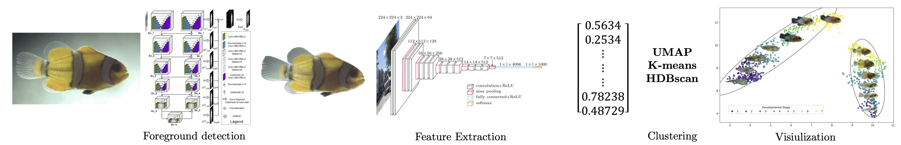

# DEEPFIN – Unsupervised Clustering of Fish Images

<!-- ❗ TODO replace the src with your PNG once it's in figures/ -->
<p align="center"></p>


DeepFin is an end-to-end, fully reproducible pipeline that

1. Removes image backgrounds with **rembg** python package
2. Extracts high-dimensional feature vectors with the **EfficientNet V2-L** imagenet pretrained model architecture
3. Dimensional reduction using **UMAP**  
4. Morpho-visual clustering using **HDBSCAN** or **k-means**  
5. UMAP embedding scatter plot visualization (optional thumbnails)  

The approach is data-source agnostic and was validated on both novel anemone fish images and the public fish images data sets. The sample images are of Acipenseridae and Tinca Tinca fish species from the AFFiNe | Angling Freshwater Fish Netherlands database.

### Interactive demo of closely related anemone fish images

[Live interactive scatter plot](https://alexandru-mihai-94.github.io/deepfin_clustering/scatter_test.html)
---

## Quick start

```bash
# clone
git clone https://github.com/alexandru-mihai-94/deepfin_clustering.git
cd deepfin_clustering

# Python ≥ 3.9
python -m venv .venv
source .venv/bin/activate
pip install -r requirements.txt
pip install -e .           # editable install of the deepfin package

# minimal demo (uses 3–5 sample images)
python -m deepfin.pipeline run_demo sample_images
open results/umap_demo.png   # or any image viewer

